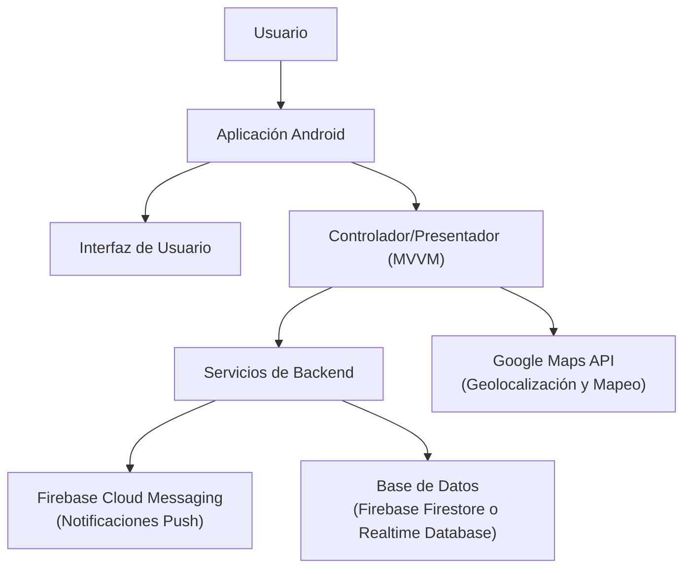
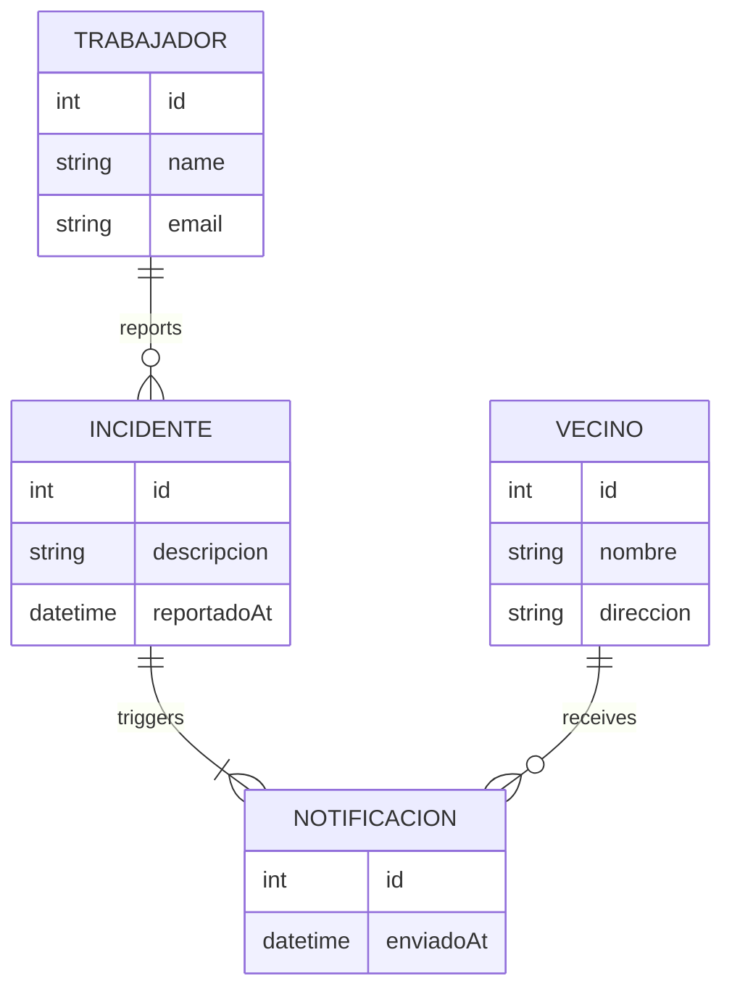
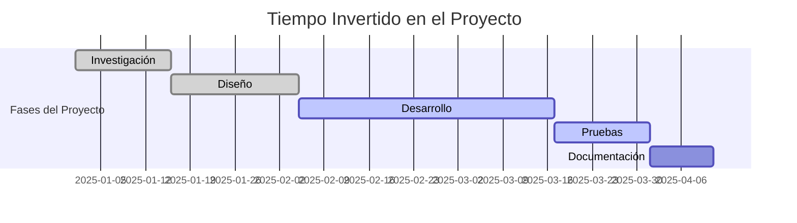

# TFG: Gestión de Incidencias en el Suministro de Agua 🚰

 
 

## Tabla de Contenidos
- [Introducción](#introducción)
- [Descripción del Proyecto](#descripción-del-proyecto)
- [Características](#características)
- [Tecnologías Utilizadas](#tecnologías-utilizadas)
- [Video Informativo](#video-informativo)
- [Diagrama de Arquitectura](#diagrama-de-arquitectura)
- [Diagrama Entidad Relación](#diagrama-entidad-relación)
- [Tiempos Invertidos](#tiempos-invertidos)
- [Contacto](#contacto)

## Introducción

¡Bienvenidos a mi proyecto! En este TFG he trabajado para desarrollar una solución que ayude a *mejorar la gestión del agua*. La aplicación permite que los trabajadores encargados de la gestión reporten incidencias en tiempo real, notificando a los vecinos afectados.

## Descripción del Proyecto

En este proyecto, he desarrollado una herramienta que sirva para:

- *Permita reportar incidencias* de forma rápida y precisa.
- *Notifique automáticamente* a los vecinos de la zona afectada.
- *Visualice las averías* mediante un mapa interactivo, facilitando la identificación de la ubicación exacta.

## Características

- *Reporte de Incidencias:*  
  Los trabajadores pueden indicar el punto exacto de la avería en un mapa interactivo.
  
- *Notificaciones Push:*  
  Alertas automáticas para los vecinos que se vean afectados. Indicando las horas en las que dicho corte de agua va a afectarles.  
  
- *Interfaz Amigable:*  
  Diseño intuitivo y moderno que facilita la interacción de los trabajadores.

### Funcionalidades Adicionales:
- 🔒 *Seguridad:* Gestión segura de datos.
- 🌐 *Actualización en Tiempo Real:* Información siempre al día.
- 📊 *Estadísticas:* Visualización de datos históricos y tendencias.

## Tecnologías Utilizadas

- *Kotlin:* Lenguaje principal de desarrollo.
- *Android Studio:* Entorno de desarrollo integrado (IDE).
- *Firebase Cloud Messaging:* Sistema de notificaciones en tiempo real.
- *Google Maps API:* Integración de mapas para la geolocalización.

| Tecnología                | Descripción                                               |
|---------------------------|-----------------------------------------------------------|
| *Kotlin*                | Lenguaje de programación moderno y conciso                |
| *Android Studio*        | IDE robusto para el desarrollo de aplicaciones Android    |
| *Firebase Cloud Messaging* | Envío de notificaciones push en tiempo real             |
| *Google Maps API*       | Servicios de mapas y geolocalización interactiva            |

## Video informativo 

## Diagrama de Arquitectura

## Diagrama Entidad Relación

## Tiempos invertidos

## Contacto  

Si tienes alguna pregunta, sugerencia o quieres contribuir al proyecto, puedes contactarme a través de:  

📧 **Email:** [serranolampre@gmail.com](mailto:serranolampre@gmail.com)  
🔗 **LinkedIn:** [Julia Serrano Lampre](https://www.linkedin.com/in/juliaserranolampre/)  
🐙 **GitHub:** [Selampr](https://github.com/selampr)  

